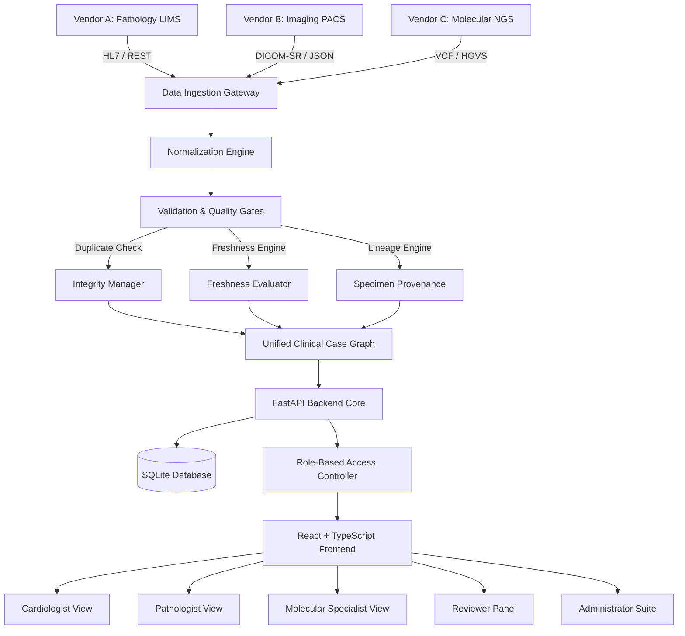

# CardioEvidence — Architecture Documentation

## 1. System Overview

**CardioEvidence** is an integrated multidisciplinary clinical evidence platform designed to address the challenge of fragmented diagnostic workflows in cardiology care. In modern medical centers, cardiovascular diagnostic evidence originates across heterogeneous, vendor-siloed systems:

- **Pathology & Laboratory Medicine (Vendor A / Vendor D)**: Serum biomarkers, High-Sensitivity Troponins, CK-MB mass, NT-proBNP, Endomyocardial biopsy histopathology.
- **Cardiovascular Diagnostic Imaging (Vendor B / Vendor E)**: 2D/3D Transthoracic Echocardiography, Stress Echocardiography, Coronary CT Angiography (CCTA), Cardiac Magnetic Resonance (CMR), SPECT Myocardial Perfusion.
- **Molecular Diagnostics & Genomics (Vendor C)**: Targeted Next-Generation Sequencing (NGS) panels (Cardiomyopathy, Arrhythmia, Familial Hypercholesterolemia, Amyloidosis TTR), Pharmacogenomics (PGx CYP2C19 clopidogrel resistance).

Currently, clinicians spend significant clinical time logging into separate software portals, transcribing test dates and values, and manually verifying specimen alignment. CardioEvidence automates this multi-vendor ingestion, validation, and timeline assembly.

---

## 2. Component Architecture

---

## 3. Data Processing Pipeline

The 6-stage provenance pipeline runs on every ingested diagnostic payload:

1. **Vendor Transmission**: The emitting diagnostic device (e.g. Cobas analyzer, Philips Epiq echo cart, Illumina NovaSeq sequencer) emits a structured result payload.
2. **Data Ingestion Gateway**: CardioEvidence REST endpoint (`/evidence` or `/ingestion/generate`) receives and timestamps the payload.
3. **Data Normalization**: Vendor-specific codes are standardized into normalized diagnostic schemas (SNOMED-CT, LOINC, HGVS nomenclature).
4. **Validation & Quality Gates**:
   - Duplicate Detection: Guarantees `event_id` uniqueness across vendors.
   - Freshness Engine: Calculates event age relative to current time (`Current` <7d, `Stale` 7–30d, `Very Stale` >30d).
   - Lineage Verification: Asserts that the specimen ID matches registered patient specimens.
5. **Case & Specimen Linkage**: Relates the test to the target `case_id` and parent specimen tree.
6. **Unified Timeline Assembly**: Emits to the multidisciplinary case timeline with role-based visibility filters.

---

## 4. Security, RBAC, and Privacy Boundary

- **Role-Based Access Control (RBAC)**: Active role enforcement dynamically filters available sidebar pages, detail drawers, and action capabilities.
- **Consent Governance**: Supports `Granted`, `Restricted`, and `Pending` consent states. When consent is `Restricted`, molecular and genetic data are withheld with a visible lock badge and access attempts are recorded in the immutable audit log.
- **Safety Boundary**: The application is strictly designated as **Synthetic Data / Demonstration Only** and contains explicit warnings that it must never be used for real patient clinical diagnosis or treatment.
