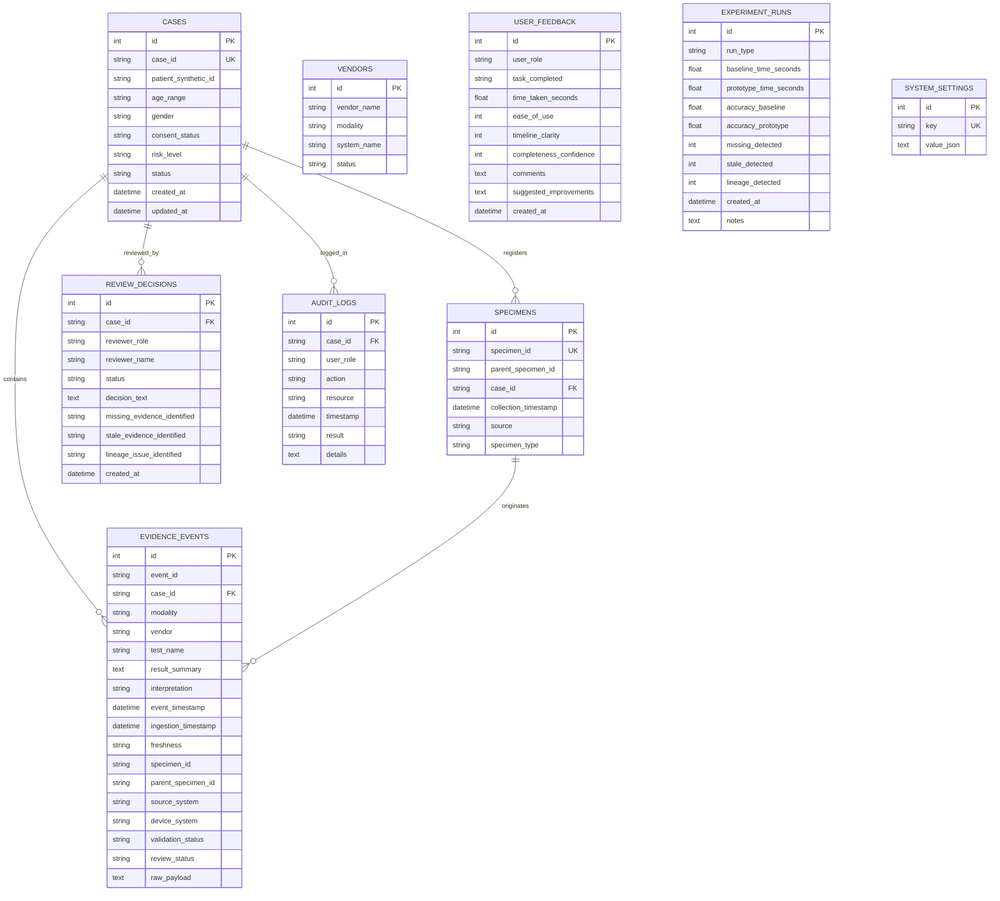

# CardioEvidence — Relational Data Model

The application uses SQLite with SQLAlchemy ORM models.

---

## 1. Entity-Relationship Diagram

---

## 2. Table Schemas

### `cases`
Primary registry of synthetic cardiovascular cases.
- `case_id`: Unique identifier (e.g. `CASE-1001`, `CASE-1002`).
- `consent_status`: `Granted`, `Restricted`, `Pending`.
- `risk_level`: `Low`, `Moderate`, `High`.
- `status`: `Complete`, `Needs Review`, `Incomplete`, `Blocked`, `Under Review`.

### `evidence_events`
Canonical unit of clinical evidence.
- `modality`: `Pathology`, `Imaging`, `Molecular`.
- `freshness`: `Current` (<7d), `Stale` (7-30d), `Very Stale` (>30d), `Missing`.
- `validation_status`: `Valid`, `Duplicate`, `Lineage Mismatch`, `Conflicting`, `Invalid`.
- `review_status`: `Unreviewed`, `Reviewed`, `Flagged`.

### `specimens`
Specimen provenance tree.
- Supports hierarchy with `parent_specimen_id` for aliquot tracking.

### `review_decisions`
Multidisciplinary clinical panel decisions and requested evidence.

### `audit_logs`
Immutable regulatory record of system transactions and access control events.
